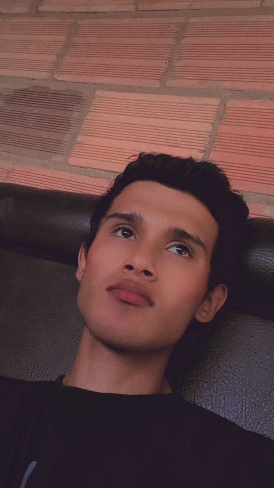

<h1>Stiven Andrei Marin Virguez</h1>

  Estudiante de Ingeniería Multimedia (7° semestre) en la UNAD. 
  Pertenezco al grupo 213027_6 del curso Programación para Videojuegos. 
  Me apasiona todo lo relacionado con el diseño y la programación.
Vivo en Bogotá D.C, Me apasiona la industria de los videojuegos y me imagino en un futuro como un creador de videojuegos

  Mi rol es descubrir cosas nuevas, me gusta explorar lo desconocido y me gustaría ser un gran ingeniero.

